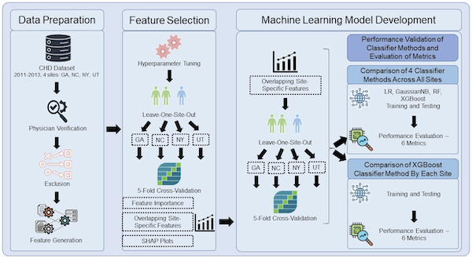

**Wendy Book, MD**, Professor of Medicine at Emory University School of Medicine and Epidemiology at the Rollins School of Public Health; Adult Congenital Heart Defect Cardiologist; former Director of the Emory Adult Congenital Heart Center (2001 to 2022); Principal Investigator for the Congenital Heart Defects Surveillance across Time And Regions (CHD STAR, Component A) and the CHD STAR Machine Learning (Component B) projects at Emory University.

**Reza Sameni, PhD**, Associate Professor in the Department of Biomedical Informatics and Biomedical Engineering at Emory University and the Georgia Institute of Technology; Scientific Director of the Medical Imaging, Informatics, and AI Core at Emory University School of Medicine. Co-I on CHD STAR, Component B.

---

## Background
Congenital heart defects (CHDs) occur in approximately 1% of births, or 40,000 annually, in the United States. CHD anatomy can range from complex structures, which typically involve severe defects requiring surgery within the first year of life, to shunt defects that allow blood mixing and do not always necessitate intervention, to valve defects that may progress over time to other issues such as coronary artery anomalies. The consequences of heart defects vary based on factors including the type of defect and the repairs undertaken.

Survival rates in infants with CHD into adulthood have significantly increased over the past few decades, thanks to screening programs that enable early detection during and after pregnancy, as well as innovative surgical procedures that correct or modify structural defects. Additionally, collaborative public health surveillance among clinicians, public health professionals, and other researchers has created an environment where CHD survival can be assessed alongside comorbidities, healthcare utilization, and socioeconomic factors, influencing decision-making in healthcare policy and clinical settings.

## Congenital Heart Defects Projects at Emory University
Since 2012, the Emory Adolescent and Adult Congenital Heart Defect (CHD) Program, in collaboration with the Centers for Disease Control and Prevention (CDC) and other institutions nationwide, has been striving to enhance understanding of the strengths and limitations of CHD surveillance in the U.S., describe the characteristics and healthcare utilization of the adolescent and adult CHD population, and inform actions to improve health outcomes and address inequities. A brief overview of these programs led by Dr Wendy Book and her team at Emory are presented below. Further information can be found at:
- [Emory University's Congenital Heart Defects Program](https://sph.emory.edu/research/centers/congenital-heart-defect/index.html)
- [Emory University's Congenital Heart Disease Center](https://scholarblogs.emory.edu/congenitalheart/team/)

### Surveillance of Congenital Heart Defects (CHDs) Focusing on Adolescents and Adults: 2012-2015 (Pilot Project)
**Funding and Support:** Centers for Disease Control and Prevention; Award Number: CDC‐RFA‐DD12-1207

**Surveillance Period:** 2008 - 2010

**Collaborators:** The initiative involved the CDC’s National Center on Birth Defects and Developmental Disabilities in Atlanta, GA, and included multiple sites across GA, MA, and NY. Collaborators ranged from Emory University’s medical and public health schools to state health departments and various pediatric and adult healthcare providers.

**Project Goals:** Evaluate the feasibility of population-based CHD surveillance across multiple sites. Estimate the prevalence of CHD among adolescents and adults. Examini survival rates, healthcare utilization, and long-term outcomes for those with CHD.

**Key Findings:** A significant number of U.S. individuals live with CHD, receiving ongoing care. A substantial portion of adolescents and adults with CHD have mental health diagnoses Women with CHD face increased risks during pregnancy. The prevalence of severe CHD varies by location, with significant disparities in Medicaid coverage across states. Comorbid conditions are commonly reported, impacting overall health burdens.

**Methodological Insights:** The study employed capture-recapture methods to adjust for underreporting, estimating a prevalence of 7.85 per 1,000 for adolescents and 6.08 per 1,000 for adults in Metro Atlanta. Issues with ICD coding accuracy were highlighted, particularly with code 745.5, which often misclassifies patients with non-CHD conditions.

**Additional Research on CHD in Pregnant Women:** Data shows that a notable percentage of women with CHD of childbearing age experience pregnancy, with those having severe CHD facing higher rates of non-gestational health issues. Insurance coverage varies greatly, with government insurance more prevalent among pregnant women in GA and MA, compared to NY where private insurance is more common.

## Surveillance of CHD across the Lifespan: 2015-2019
**Funding and Support:** Centers for Disease Control and Prevention; Award Number: CDC‐RFA‐DD15-1506

**Surveillance Period:** 2011 - 2013

**Collaborators:** This initiative was led by the CDC's National Center on Birth Defects and Developmental Disabilities in Atlanta, GA, involving additional sites across CO, GA, NC, NY, and UT. Collaborative efforts included Emory University's medical and public health schools, along with numerous healthcare providers for both pediatric and adult care.

**Project Goals:** Assess the prevalence of CHD across the lifespan, focusing on healthcare utilization and comorbidities, including heart failure. Evaluate barriers to the appropriate transition from adolescent to adult cardiac care, especially in NY and GA. Develop and implement educational modules in GA.

**Key Findings:** CHD complexities included 24% with complex anatomy, 37% with shunt defects, and 53% with valve defects. A racial and demographic breakdown showed 19% black or multi-racial and 15% Hispanic participants, with 48% having public insurance. Transition from pediatric to adult care showed low overall retention, with severe CHD cases more likely to transfer to adult congenital heart disease (ACHD) care settings. Barriers to care transition included concerns about losing pediatric relationships, obtaining insurance, and finding suitable adult providers.

**Research Insights:** The study highlighted racial and socioeconomic disparities in healthcare outcomes, validated CHD codes in ICD-9-CM, and explored pregnancy outcomes and healthcare utilization. A study spanning five U.S. sites from 2011 to 2013 identified 42,646 CHD cases, with a significant portion being severe. The prevalence varied with age and severity, providing a detailed demographic and clinical profile of the CHD population. A survey among parents of adolescents with CHD highlighted significant concerns about transitioning to adult care, including difficulties in finding appropriate providers and managing health insurance changes.

**Clinical and Mortality Insights:** A study examining hypertension and heart failure as predictors of mortality in adults with CHD found increased risks associated with these conditions, emphasizing the importance of continuous specialty care regardless of the complexity of the heart defect.

## Congenital Heart Defects (CHD) Surveillance across Time and Regions (CHD-STAR): 2019-2024

**Funding and Support:** Centers for Disease Control and Prevention; Award Numbers: CDC‐RFA‐DD19-1902A and 1902B

**Surveillance Period:** 2010 - 2019

**Collaborators:** Coordinated by the CDC’s National Center on Birth Defects and Developmental Disabilities and Emory University, with additional collaboration from multiple sites across AZ, GA, IA, NC, NY, SC, and UT, including various healthcare providers and community advisory committees.

**Component A Objectives:** Conduct population-based surveillance of CHD among individuals aged 1-45. Examine the descriptive epidemiology of CHD, focusing on survival, healthcare utilization, comorbidities, and mortality. Enhance understanding of CHD health outcomes for public health practitioners and improve age-specific mortality estimates. Improve racial/ethnic and socioeconomic pattern recognition in healthcare usage and its impact on long-term outcomes.

**Component B Objectives:** Validate billing codes for CHDs in healthcare claims data. Determine the best practices for using healthcare claims for CHD surveillance across different life stages. Utilize machine learning techniques to improve the validity and utility of healthcare claims data for CHD surveillance and increase public awareness.

**Key Project Aims:** Integrate surveillance systems using individual encounter level data from 2010-2019 to better understand CHD across Georgia’s demographic based on the 2010 Census and the 2017 American Community Survey. Validate over 1500 CHD cases using medical record reviews, leveraging machine learning to optimize the positive predictive value (PPV) and sensitivity of CHD detection in healthcare claims.

**Impact and Outcomes:** Provided significant insights into the validity and utility of healthcare claims data for CHD surveillance, contributing to improved accuracy in identifying and monitoring CHD. Helped refine strategies for secondary prevention, enhancing decision-making among stakeholders and supporting more effective public health interventions for CHD. Enhanced community and regional partnerships will support the education and consistency of data quality, improving CHD awareness and healthcare planning.

## Emory's Congenital Heart Defect Center

Emory's Congenital Heart Defect Center stands as a beacon of comprehensive care and support for individuals with CHD. With a multifaceted approach, the center focuses on the seamless transition of care from childhood to adult services, robust educational programs, and supporting our team's cutting-edge research on CHD.

### Services for Teens
A core mission of the center is to facilitate a smooth transition for teenagers with CHD into adult healthcare. The center offers an interactive section specifically designed for teens, which addresses their unique concerns about CHD, lifestyle implications, and future planning. This interactive tool not only educates but also engages teen agers in proactive health management.

### Support for Parents
Recognizing the challenges faced by parents of children with CHD, the center provides targeted resources to assist them. These resources include guidance on discussing CHD with children of various ages, advice on managing the emotional and practical aspects of CHD care, and links to supportive networks and communities. Parental education is geared towards empowering families with knowledge and strategies for daily and long-term management of CHD.

### Educational Services
The center is committed to educating both the public and healthcare professionals about CHD. Through partnerships with leading health organizations, it disseminates up-to-date, research-backed information on CHD management and care. Educational materials cover a range of educational services from basic heart health to complex surgical interventions, aiming to increase awareness and understanding of CHD.

### Interactive Surveillance and Research
Our future perspective for Emory's Congenital Heart Defect Center is to integrate AI and machine learning into our interactive surveillance project. This innovative approach aims to revolutionize the monitoring and treatment of CHD by employing predictive analytics. Through machine learning, we envision improving the precision of CHD tracking and enhancing patient outcomes by developing more personalized and proactive treatment strategies. This integration represents a forward-looking perspective, seeking to set new standards in the care and management of congenital heart defects.

## Emory BMI's Contribution to CHD STAR (Component B)

Reference: [A machine learning model for predicting congenital heart defects from administrative data](https://doi.org/10.1002/bdr2.2245). Birth Defects Research, 115(18), pp.1693-1707.

[Haoming Shi](haoming.shi@emory.edu)1*, [Wendy M. Book](wbook@emory.edu)2,3, [Lindsey C. Ivey](lcivey@emory.edu)3, [Fred H. Rodriguez III](rodriguez@emory.edu)2,4, [Cheryl Raskind-Hood](craskin@emory.edu)3, [Karrie F. Downing](yyx9@cdc.gov)5, [Sherry L. Farr](bwa0@cdc.gov)5, [Alexandra P. Haffner](alexandra.primm.haffner@emory.edu)3, [Courtney E. McCracken](Courtney.e.mccracken@kp.org)6, [Vinita O. Leedom](Leedomvo@dhec.sc.gov)7, [Susan E. Haynes](Susan.haynes@prismahealth.org)8, [Sandra Amouzou](sandraamouzou9@gmail.com)6, [Reza Sameni](rsameni@dbmi.emory.edu)1,9, [Rishikesan Kamaleswaran](rkamales@dbmi.emory.edu)1,9
 
1. Department of Biomedical Engineering, Georgia Institute Technology, Atlanta, GA
2. Department of Medicine, Division of Cardiology, Emory University School of Medicine, Atlanta, GA
3. Department of Epidemiology, Emory University, Rollins School of Public Health, Atlanta, GA
4. Children’s Healthcare of Atlanta, Atlanta, GA
5. National Center on Birth Defects and Developmental Disabilities, Centers for Disease Control and Prevention, Atlanta, GA
5. Center for Research and Evaluation, Kaiser Permanente Georgia, Atlanta, GA 
7. South Carolina Department of Health and Environmental Control
8. Prisma Health Upstate, South Carolina
9. Department of Biomedical Informatics, Emory University School of Medicine, Atlanta GA

### Overview
While International Classification of Diseases (ICD) codes recorded in administrative data are often utilized for congenital heart defect (CHD) identification in surveillance datasets, their reliability is compromised due to a significant false positive rate. The accuracy of CHD identification could be improved by incorporating machine learning algorithms, leading to more reliable surveillance.

### Methods 
To identify relevant features for accurate identification of CHD-positive patients, machine learning models were developed and employed on a validated dataset containing encounter level data on 3,334 patients in four datasets from distinct sites. These patients had at least one of 87 CHD-related ICD-9-CM and ICD-10-CM codes identified in the electronic medical record between 2010-2019.

Identifiers such as geographic variables were excluded from the dataset. A five-fold cross-validation approach was applied to the validated dataset to determine the set of overlapping important features that best classified true positive CHD cases. 
The performance metrics evaluated includes median values and corresponding 95% confidence intervals of area under the receiver operating curve (AUROC), positive predictive value (PPV), negative predictive value (NPV), sensitivity, specificity, and F1-score. 
Different training and testing combinations were explored to determine a generalized and robust approach that yielded the best classification of true positive CHD cases.

### Results 
Baseline PPV of ICD codes for CHD classification was 53.2%, 58.2%, 68.1%, and 84.0% for the Kaiser, South Carolina, combined adult/pediatric, and legacy cardiac database, respectively. 
Overall, the proposed machine learning algorithm achieved PPV of 95% (1273/1340  ) for the overall dataset with a false negative rate (FNR) of 33% (639/1912) by a chosen operating point from the PPV-FN rate curve for CHD prediction across the four datasets, prioritizing PPV. Applying XGBoost for feature selection decreased 2,105 CCS schemes generated features to the 137 best features that identified true positive CHD and false positive CHD cases. 

### Codebase 
The following private repository contains [sample codes](./Generalized_CHD_Prediction_Using_ICD_Codes.ipynb), the [pretrained models](./pretrained_CHD_XGBoost.model), and [a sample data (exemplifying real data)](./sampled_df.csv) for identifying patients with congenital heart disease (CHD) using a history of administrative data. Please contact the project PI for access to these codes.
