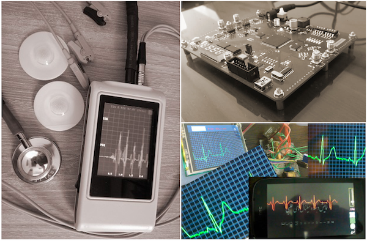

- [Biomedical signal processing](#bsp)
    - [The open-source electrophysiological toolbox (OSET)](#oset)
    - [ECG image digitization tools](#ecg_image_digitization)
    - [ECG analysis](#ecg_analysis)
    - [Multimodal cardiac monitoring](#multimodal_cardiovascular)
    - [EEG analysis](#eeg_analysis)
    - [Noninvasive fetal electrocardiography](#f_ecg)
    - [Noninvasive fetal magnetoencephalography](#f_meg)
    - [Multimodal physiological signal monitoring](#prescribe)
- [Public health](#public_health)
    - [Demography-aware blood pressure monitoring](#blood_pressure)
    - [Congenital heart defects](#chd)
    - [Pandemic spread modeling and control](#pandemic_modeling_control)
    - [Maternal-fetal healthcare in low-resourced settings](#maternal_fetal_health_low_resource)
- [Data challenges and crowdsourcing](#data_challenge_crowdsourcing)
    - [PhysioNet challenges](#physionet_challenges)
    - [PhysioCrowd](#physiocrowd)
- [Former projects](#former_research)
    - [Portable monitors](#hardware_design)
    - [Computational hardware/firmware architecture design](#fpga_design)
    - [Interpretive signal processing](#interpretive_signal_processing)

---
## Biomedical signal processing 

### The open-source electrophysiological toolbox (OSET) 

The [OSET]((https://github.com/alphanumericslab/OSET)) is a codebase aiming to enhance biomedical informatics and engineering through open-source software development, particularly in biomedical signal processing. Recognizing the gap between advanced data-driven methods and domain-specific skills, OSET was conceived in 2006, building on well-designed and science-driven methodologies for physiological time-series analysis. OSET's functionalities started with toolsets for electrocardiogram data analysis, and were gradually extended to electroencephalogram and phonocardiogram data, which are the most commonly acquired time-series data in biomedical applications. It also features biosignal modeling tools for data augmentation for training machine learning and deep learning models. It also offers generic biosignal processing tools for denoising and curating all types of physiological time-series recordings. The OSET codebase is primarily developed in MATLAB, with some partial functionalities in C++ and more recently in Python. It operates under a permissive open license, encouraging community-driven development. This approach provides a transparent means for implementing physiological signal processing pipelines and offers standardized benchmarking for research and development purposes. Over the years, some modules of OSET have been translated to Python and C/C++, and integrated into medical devices and cloud-based diagnostic software for managing large datasets.

### Tools, data and software for ECG image digitization 

With the shift from printed to digital formats, converting paper or scanned ECG records into time-series data has become essential, especially for machine learning (ML) applications. Scanned ECG images, often deteriorated or incomplete, are not directly usable for ML training, making robust digitization crucial.

To address this need, we have developed [ECG-Image-Kit](https://github.com/alphanumericslab/ecg-image-kit), a toolkit designed to generate synthetic ECG images that replicate real-world imperfections; and [ECG-Image-Database](https://arxiv.org/abs/2409.16612) a database of ECG images with real-world artifacts. These images include realistic artifacts such as wrinkles, handwritten notes, aging effects, mold growth and other imaging artifacts. The goal is to create training data that allows ML models to accurately digitize and analyze ECGs, while ensuring no personal data is included in the synthetic images. The toolkit facilitates various tasks, including the conversion of ECG images back into usable time-series data through advanced image processing techniques, enabling accurate medical analysis.

The [2024 PhysioNet Challenge](https://moody-challenge.physionet.org/2024/) has adopted ECG-Image-Kit and ECG-Image-Database to support teams developing ML models for digitizing and classifying ECGs. The toolkit plays a critical role in data augmentation, helping researchers overcome issues related to small and noisy datasets by providing a broader range of training images with realistic distortions. This improves the robustness of deep learning algorithms in real-world settings. 

For more information, you can explore the following key resources:
- [ECG-Image-Kit: A Toolkit for Synthesis, Analysis, and Digitization of Electrocardiogram Images (2024)](https://github.com/alphanumericslab/ecg-image-kit)
- [ECG-Image-Database (2024)](https://arxiv.org/abs/2409.16612)
- [PhysioNet Challenge 2024: ECG Image Digitization](https://moody-challenge.physionet.org/2024/)

### Electrocardiogram (ECG) analysis 

In a continuum of research, our team pioneered the field of model-based cardiac signal processing with applications in adult and fetal electrocardiography, phonocardiography, long-term Holter monitors and wearable devices. The highlights of this research, which resulted in a new track in biomedical cardiac signal processing over several years are:
- Sameni, R, Shamsollahi, MB, Jutten, C and Clifford, GD, [A Nonlinear Bayesian Filtering Framework for ECG Denoising](https://doi.org/10.1109/TBME.2007.897817), IEEE Trans Biomed Eng. 2007 Dec; 54(12):2172-85. PMID: 18075033.
- Sameni, R. (2017). [Online filtering using piecewise smoothness priors: Application to normal and abnormal electrocardiogram denoising](https://doi.org/10.1016/j.sigpro.2016.10.019), Signal Processing (Vol. 133, pp. 52–63), Elsevier BV.
- Dumitru M, Li Q, Perez Alday E.A, Bahrami Rad A, Xue J, Albert D, Clifford G.D, and Sameni R (2022). [A Data-Driven Gaussian Process Filter for Electrocardiogram Denoising](https://doi.org/10.48550/arXiv.2301.02607). ISCE 2022, Lake Las Vegas Resort and Spa, 6-10, April 10

### Multimodal cardiac monitoring 

The EPHNOGRAM project aimed to develop a low-cost, low-power device for simultaneous electrocardiogram (ECG) and phonocardiogram (PCG) recording, incorporating additional channels for environmental audio to enhance PCG through active noise cancellation. The objective was to study the multimodal electro-mechanical activities of the heart, providing insights into the differences and synergies between these modalities during various cardiac activity levels. To date, we have collected an open-access simultaneous ECG and PCG dataset from young, healthy adults during a stress test.

Funded by the American Heart Association, we are using this dataset to advance the field of cardiovascular diagnostics by developing a novel sensor fusion technology that integrates ECG and PCG to simultaneously monitor the electrical and mechanical activities of the heart. By leveraging state-of-the-art machine learning and time-series analysis, we aim to create multimodal biomarkers that enhance diagnostic precision beyond the capabilities of individual modalities. This project addresses significant gaps in current clinical practices and knowledge, especially the limited use of multimodal data in cardiovascular research and its potential in low-resource and ambulatory settings. We aim to develop robust algorithms to extract and fuse ECG and PCG data, investigate the interaction between the heart's electrical and mechanical functions, and explore the generalizability of this approach to other cardiac modalities. The success of this research could lead to breakthroughs in understanding heart function and improving cardiovascular disease (CVD) diagnostics, which would be particularly beneficial for ambulatory monitoring and in resource-limited environments. Read more:

- A Kazemnejad,  P Gordany,  R Sameni, [EPHNOGRAM: A Simultaneous Electrocardiogram and Phonocardiogram Database](https://physionet.org/content/ephnogram/)

- A Kazemnejad, S Karimi, P Gordany, G D Clifford and R Sameni (2024), [An open-access simultaneous electrocardiogram and phonocardiogram database](https://doi.org/10.1088/1361-6579/ad43af), Physiological Measurement

### Electroencephalogram (EEG) analysis 
The EEG phase, including the instantaneous phase (IP) and instantaneous frequency (IF), has emerged as a rich complement to the EEG spectrum, essential for understanding phenomena such as phase coupling and phase resetting. We have made significant contributions to EEG analysis, demonstrating through theoretical proof how the common EEG phase calculation method, widely documented in the literature, is highly susceptible to noise and minor variations in algorithmic parameters. To address this, our team developed a robust Monte Carlo algorithm for EEG phase calculation and successfully applied it in brain-computer interface applications. The source code of this project is available online for public use. Additionally, we have developed algorithms and software to remove electrooculogram (EOG) artifacts from multichannel EEG recordings, serving as a complement to classical ICA-based methods, which often face challenges in automation and performance consistency. Read more:

- Sameni, R., and Seraj, E. (2017). [A Robust Statistical Framework for Instantaneous Electroencephalogram Phase and Frequency Estimation and Analysis](https://doi.org/10.1088/1361-6579/aa93a1). Physiological measurement, 38(12), 2141.
- Sameni, R., and Gouy-Pailler, C. (2014). [An iterative subspace denoising algorithm for removing electroencephalogram ocular artifacts](https://doi.org/10.1016/j.jneumeth.2014.01.024). Journal of neuroscience methods, 225, 97-105.
- Karimzadeh, F., Boostani, R., Seraj, E., & Sameni, R. (2017). [A distributed classification procedure for automatic sleep stage scoring based on instantaneous electroencephalogram phase and envelope features](https://doi.org/10.1109/TNSRE.2017.2775058). IEEE Trans on Neural Systems and Rehabilitation Engineering, 26(2), 362-370.
- The MATLAB source codes for this method are available in our [EEG frequency and phase analysis toolbox](https://github.com/rsameni/EEG-PhaseFreq-Analysis).

### Noninvasive fetal electrocardiography 

Since 2005, our team has made significant contributions to various aspects of fetal cardiac monitoring, employing noninvasive modalities such as fetal electrocardiogram, magnetocardiogram, phonocardiogram, and Doppler ultrasound. These efforts have culminated in a US patent, utilized in an FDA-approved fetal ECG monitor produced by [MindChild Medical Inc.](https://www.mindchild.com/), a series of publications, and open-access datasets and codes. Recent scientific advances from the team include: a) the implementation of online fetal ECG (fECG) extraction using online source separation algorithms; b) the use of fECG to estimate and track fetal movements/rotations relative to maternal body coordinates; c) noninvasive fECG extraction from low-rank (as few as a single-channel) and time-varying mixtures; d) the development of a novel semi-blind source separation algorithm for fECG extraction in the presence of nonstationary noise and irregular maternal beats.

- Sameni, R, 2021. [Noninvasive Fetal Electrocardiography: Models, Technologies, and Algorithms](https://doi.org/10.1007/978-3-030-54403-4_5). In Innovative Technologies and Signal Processing in Perinatal Medicine (Ch. 5, pp. 99-146). Springer, Cham.
- Sulas E, Urru M, Tumbarello R, Raffo L, Sameni R, Pani D. [A non-invasive multimodal foetal ECG-Doppler dataset for antenatal cardiology research](https://doi.org/10.1038/s41597-021-00811-3). Sci Data. 2021 Jan 26;8(1):30. doi: 10.1038/s41597-021-00811-3. PMID: 33500414; PMCID: PMC7838287.
- Jamshidian-Tehrani F, Sameni R. [Fetal ECG extraction from time-varying and low-rank noninvasive maternal abdominal recordings](https://doi.org/10.1088/1361-6579/aaef5d). Physiol Meas. 2018 Dec 21;39(12):125008. doi: 10.1088/1361-6579/aaef5d. PMID: 30523836.
- Sameni, R, and Samieinasab, M. [Shiraz University Fetal Heart Sounds Database](https://doi.org/10.13026/42eg-8e59) (version 1.0.0, 2017, version 1.0.1, 2021). PhysioNet. 
- Sameni, R, Clifford, G.D, Jutten, C, and Shamsollahi, MB. (2007). [Multichannel ECG and noise modeling: Application to maternal and fetal ECG signals](https://doi.org/10.1155/2007/43407). EURASIP Journal on Advances in Signal Processing, 2007, 1-14.
- Sameni, R. (2008). [Extraction of fetal cardiac signals from an array of maternal abdominal recordings](https://hal.science/tel-00373361/). Doctoral dissertation, Institut National Polytechnique de Grenoble-INPG; Sharif University of Technology (SUT).

  
### Noninvasive fetal magnetoencephalography 

Using advanced multichannel signal processing techniques, we have been able to extract and study the magnetoencephalogram (MEG) of the fetus from noninvasive signals recorded by SQUID technology systems. Our contribution in this project has been in the signal processing aspects and we have used datasets provided by our colleague Prof. Dirk Hoyer, from the Biomagnetic Center in Jena, Germany. Read more:

- Moraru, L., Sameni, R., Schneider, U., Haueisen, J., Schleußner, E., and Hoyer, D. (2011). [Validation of fetal auditory evoked cortical responses to enhance the assessment of early brain development using fetal MEG measurements](https://doi.org/10.1088/0967-3334/32/11/002). Physiological measurement, 32(11), 1847.
- Razavipour, F., & Sameni, R. (2013). [A general framework for extracting fetal magnetoencephalogram and audio-evoked responses](https://doi.org/10.1016/j.jneumeth.2012.10.021). Journal of neuroscience methods, 212(2), 283-296.

### Multimodal physiological signal monitoring 
Understanding implicit beliefs and intentions has long been a focus in psychology, neuroscience, and artificial intelligence. Traditional methods, such as self-report questionnaires, depend on participants' conscious reflection, which can introduce biases and inaccuracies. Recent advancements in neurophysiological sensing technologies provide an opportunity to explore beliefs and intentions at a preconscious level, offering more accurate and objective assessments. The PRESCRIBE study employs a multimodal approach to capture physiological and cognitive data, specifically designed to study individualized belief evaluation. The study integrates various modalities, including electroencephalogram (EEG), electrocardiogram (ECG), seismocardiogram (SCG), respiration, blood pressure, photoplethysmogram (PPG), electrodermal activity (EDA), pupillometry, and eye-tracking data. The data collection process is synchronized across multiple systems: PsychoPy software for experiment control, BioSemi ActiveTwo for EEG data, Biopac for additional physiological signals, and EyeLink 1000 Plus for pupillometry and eye-tracking. Read more:

* [Prescreening Depression Using Wearable Electrocardiogram and Photoplethysmogram Data from a Psycholinguistic Experiment](./Resources/Papers/ECG_PPG_Depression_Prescreening.pdf)

* [A dashboard for multimodal physiological data feature visualization](https://alphanumerics.bmi.emory.edu/multimodal-physio-data-analysis/)

---
## Public health 

### Demography-aware blood pressure monitoring 

Regular blood pressure (BP) monitoring is crucial for managing cardiovascular diseases, though concerns persist about inaccuracies due to device errors and biases against under-represented patient demographic groups. In a series of ongoing studies we are investigating how advanced AI and machine learning models, enhanced by large language models trained on clinical literature and notes, can improve the accuracy of BP measurements and removing demographic biases. Our analysis of over 90 million patient encounters at Emory Healthcare involving more than 3.4 million unique patients reveals significant demographic variations in BP, underscoring the need for personalized healthcare approaches. Additionally, we have developed Bayesian estimation models to address BP measurement biases caused by respiratory effects and device-specific errors, aiming to refine BP monitoring technologies for better clinical outcomes. More recently, we are building blood pressure-specific natural language processing (NLP) and large-language model (LLM)-based tools. Read more:
- Mousavi, S. S., Reyna, M. A., Clifford, G. D., and Sameni, R. (2024). [A survey on blood pressure measurement technologies: Addressing potential sources of bias](https://doi.org/10.3390/s24061730). Sensors, 24(6), 1730.
- Mousavi, S. S., Guo, Y., Robichaux C., Sarker, A., Sameni, R. (2024). [Learning from Two Decades of Blood Pressure Data: Demography-Specific Patterns Across 75 Million Patient Encounters](https://arxiv.org/pdf/2402.01598.pdf). IEEE EMBC 2024, Orlando, FL, USA. arXiv preprint arXiv:2402.01598.
- Guo, Y., Mousavi, S. S., Sameni, R., and Sarker, A. (2024). [Leveraging Large Language Models for Analyzing Blood Pressure Variations Across Biological Sex from Scientific Literature](https://arxiv.org/abs/2402.01826). arXiv preprint arXiv:2402.01826.
- [Breathwork as an Intervention for White Coat Hypertension](/breathwork)

### Population-based surveillance of congenital heart diseases  

Congenital heart defects (CHDs) affect about 1% of births in the U.S. annually, ranging from severe anatomical defects requiring early surgery to more progressive conditions like valve and coronary anomalies. Survival rates have significantly improved due to early detection, innovative surgeries, and collaborative public health efforts. Since 2012, the Emory Adolescent and Adult CHD Program, in partnership with the CDC and other institutions, has enhanced CHD surveillance, analyzed health utilization, and influenced healthcare policy to better the outcomes for those with CHD and address healthcare inequities. Our lab collaborates closely with Prof Wendy Book and Emory's CHD program since 2020. We have recently extended the study to a longitudinal study of ECG data in CHD patients. Visit our detailed CHD [webpage](/chd), and read more from our published research:
- Shi, H., Book, W., Raskind‐Hood, C., Downing, K.F., Farr, S.L., Bell, M.N., Sameni, R., Rodriguez III, F.H. and Kamaleswaran, R., 2023. [A machine learning model for predicting congenital heart defects from administrative data](https://doi.org/10.1002/bdr2.2245). Birth Defects Research, 115(18), pp.1693-1707.
- [Emory University's Congenital Heart Defects Program](https://sph.emory.edu/research/centers/congenital-heart-defect/index.html)
- [Emory University's Congenital Heart Disease Center](https://scholarblogs.emory.edu/congenitalheart/team/)

### Epidemic disease spread modeling and non-pharmaceutical control  

During the COVID-19 pandemic, our lab contributed to the development of mathematical models for tracking the trend of the pandemic spread in large populations and in built settings. We created novel algorithms for model-based prediction and optimal control of pandemics through non-pharmaceutical interventions. Our team at Emory University, the Alphanumerics Team, participated in and was recognized as one of the finalists in the [XPRIZE Pandemic Response Challenge](https://www.xprize.org/articles/pandemic-response-challenge-finalists), which aimed to advance the forecasting and control of pandemics using these methods. We also collaborated closely with the Simulation and Estimation of Epidemics with Algorithms (SEEPIA) research group at Grenoble Alpes University, France. This group, formed from independent researchers with various backgrounds including mathematicians, control theory experts, signal processing experts, epidemiologists, and research engineers, synergized their expertise in modeling and forecasting the pandemic's spread under social and economic constraints.
- Sameni, R. (2020). [Mathematical modeling of epidemic diseases; a case study of the COVID-19 coronavirus](https://doi.org/10.48550/arXiv.2003.11371). arXiv preprint arXiv:2003.11371.
- Sameni, R. (2021). [Model-based prediction and optimal control of pandemics by non-pharmaceutical interventions](https://doi.org/10.1109/JSTSP.2021.3129118). IEEE Journal of Selected Topics in Signal Processing, 16(2), 307-317.
- Open-source codes and simulations [here](https://github.com/rsameni/EpidemicModeling).
- The [Simulation & Estimation of EPIdemics with Algorithms (SEEPIA)](http://51.178.55.78/SEEPIA/seepia.htm) work group.
 - Short courses on epidemic disease propagation modeling in [Farsi](https://youtu.be/Zfh2G0VpBY) and in [English](https://youtu.be/pasyQympFGE)

### Maternal-fetal healthcare in low-resourced settings 

In collaboration with Prof. Gari Clifford and our extended research team at Emory University, we are advancing maternal and fetal mobile health technology in low-resourced settings via our collaborative work with the Emory Co-Design Lab and the Guatemalan NGO Wuqu' Kawoq. The AI-driven system, safe+natal, led by Prof. Gari D. Clifford, Rachel Hall-Clifford, and Dr. Peter Rohloff, supports community healthcare workers in the highlands of Guatemala and has improved pregnancy and early childhood outcomes, leading to its adoption as standard care after a successful RCT. The team is now expanding to new populations, working with Morehouse School of Medicine on the IMPROVE Initiative in Georgia, and partnering with the Gates Foundation in sub-Saharan Africa. This project is supported by the NIH, Google.org, and the MacArthur Foundation. Read more:
- [safe+natal project](https://safenatal.org/team/)
- [Prof. Gari D. Clifford's reseearch lab](https://gdclifford.info/research)

---
## Data challenges and crowdsourcing 

### PhysioNet Challenges 

The George B. Moody PhysioNet Challenges are annual competitions that invite participants to develop automated approaches for addressing important physiological and clinical problems. Our lab collaborates closely with [Dr. Matthew A. Reyna](https://reynalab.org/) and [Prof. Gari D. Clifford](https://gdclifford.info/) and contributes to the annual [PhysioNet Challenges](https://moody-challenge.physionet.org/).

### PhysioCrowd 

PhysioCrowd aims to create a sustainable ecosystem for enhancing ECG-based diagnostics by integrating mobile and wearable device technology with advanced machine learning. This initiative seeks to address the gap between the overwhelming influx of biomedical data and the scarcity of expert analysis, exacerbated by challenges like limited data diversity and expertise in algorithmic interpretation. PhysioCrowd proposes a crowdsourcing platform combining human expertise and algorithmic annotations to develop, share, and utilize extensive ECG databases effectively. It emphasizes open licensing to ensure global accessibility, particularly benefiting under-resourced institutions and underserved populations. The platform is designed to support a collaborative environment for algorithm developers, clinicians, and researchers, fostering advancements in cardiology diagnostics and promoting inclusive participation from a diverse range of contributors worldwide. PhysioCrowd will ultimately serve as a major hub for annotated physiological data, advancing open-source algorithm development and contributing broadly to global health improvements. Read more: [PhysioCrowd ECG Annotator](https://physiocrowd.emory.edu/)

---
## Former projects 

### Portable monitors 

In our former lab at [Shiraz University](https://shirazu.ac.ir/en/home), our team has prototyped several hardware devices for biomedical applications, including three-lead ECG Holter monitors, simultaneous ECG and PCG acquisition systems, and noninvasive IR vein finders.

### Computational hardware/firmware architecture design 

Hardware accelerators are currently at the heart of many machine learning and biomedical signal processing systems. In our former research lab at [Shiraz University](https://shirazu.ac.ir/en/home), our team has contributed to the development of efficient computational firmware based on field-programmable gate array (FPGA) technologies. The objective has been to develop firmware modules common in many machine learning and biomedical signal processing systems. To date, our contributions include the development of FPGA-based linear and nonlinear filter units, automated deep and shallow neural network architectures, low-level toolboxes for matrix and vector manipulation on hardware, automated mechanisms for porting state-space systems onto FPGA, and an automated mechanism for transforming recursive signal processing pseudo-codes into FPGA-based modules. The objective of this research was to develop an ecosystem of open-source firmware modules, which can be integrated and used to develop machine learning and signal processing hardware accelerators. Considering that FPGA technology is also used for prototyping application-specific integrated circuits (ASIC), the developed units can eventually be used for developing customized machine learning chips. The FPGA hardware systems required for our firmware design and evaluation have also been designed and manufactured by our team and used as trainer boards for an FPGA lab developed and presented at Shiraz University from 2008 to 2018. Some of our scientific contributions in this area include:

 - [Hardware efficient running median filters](https://doi.org/10.1109/TCSII.2015.2504945) and its [source codes](https://rsameni.github.io/Research/Projects/MedianFilter/median.html).
 - [HDL Code Generator Toolkit](https://github.com/alphanumericslab/HDLCodeGenerators)
 - Nikahd, E., Behnam, P., and Sameni, R. (2015). [High-speed hardware implementation of fixed and runtime variable window length 1-D median filters](https://doi.org/10.1109/TCSII.2015.2504945). IEEE Transactions on Circuits and Systems II: Express Briefs, 63(5), 478-482.

### Interpretive signal processing 

Interpretive Signal Processing (ISP) is an ad hoc technique for customizing signal processing algorithms for non-numeric data. Genomic data such as DNA or protein sequences are examples of such data. Contrary to the conventional approach of coding and decoding non-numeric data to numeric values, the main idea in ISP is to interpret signal processing algorithm as they are and to tailor similar operators for the direct manipulation of non-numeric data. We have studied two cases of ISP in our previous research:
- Saadi, H. H., & Sameni, R. (2012, May). [Using matched filters for similarity search in genomic data](https://doi.org/10.1109/AISP.2012.6313793). In The 16th CSI International Symposium on Artificial Intelligence and Signal Processing (AISP 2012) (pp. 469-472). IEEE.
- Hassani Saadi, H., Sameni, R., and Zollanvari, A. (2017). [Interpretive time-frequency analysis of genomic sequences](https://doi.org/10.1186/s12859-017-1524-0). BMC bioinformatics, 18, 31-39.
- See also the extended version [here](https://rsameni.github.io/Research/Projects/ISP/ISP.html).

***
